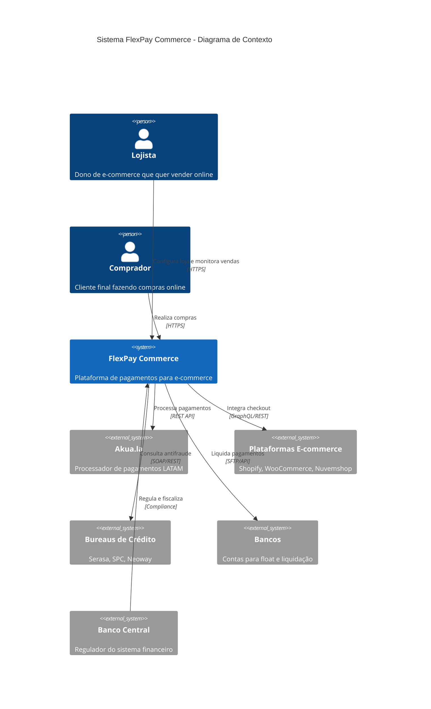

# FlexPay Commerce - Trabalho de Arquitetura de Software
## Trabalho Final - IT Architecture Design & Styles - FIAP MBA

**Professor:** Leonardo Carneiro Pinho  
**Disciplina:** Arquitetura da Escolha (UX, Design Thinking e Modern Web)  
**Tema:** Sistema de Payment Facilitator para E-commerce  

---

## 📋 ENTREGA COMPLETA DOS 23 ITENS OBRIGATÓRIOS

---

## 1. Story Telling - O Problema que Resolvemos

### A História de Marina

Marina tem uma loja de produtos artesanais em Belo Horizonte. Durante a pandemia, criou um e-commerce no Shopify e começou a vender online. Mas logo descobriu que vender online no Brasil é um pesadelo:

- **Taxas absurdas**: 4,99% + R$ 0,40 por transação no cartão
- **Dinheiro preso**: Recebe só em 30 dias (ou paga mais 2% para antecipar)
- **Checkout quebrado**: 47% dos clientes abandonam a compra
- **Integração complexa**: 3 gateways diferentes para aceitar cartão, PIX e boleto
- **Sem suporte**: Quando tem problema, ninguém responde

Marina não está sozinha. **87% dos pequenos e-commerces brasileiros** enfrentam os mesmos problemas.

### Nossa Solução: FlexPay Commerce

Uma plataforma completa de pagamentos para e-commerce que oferece:
- Payment Facilitator próprio com taxas justas (0.99% benchmark QuickFace+)
- Checkout unificado com todos os métodos de pagamento
- Recebimento em D+1 sem custo adicional
- Dashboard único para gerenciar tudo
- Suporte humano em português

---

## 2. O que Esperamos Aprender com esse Projeto?

1. **Comportamento de compra online**
   - Por que 47% dos checkouts são abandonados?
   - Quais métodos de pagamento convertem mais?
   - Como o parcelamento afeta a conversão?

2. **Tecnologia de pagamentos**
   - Como integrar com a infraestrutura da Akua.la?
   - Qual a melhor arquitetura para escalar?
   - Como garantir PCI-DSS compliance?

3. **Modelo de negócio PayFac**
   - Qual a estrutura de custos real?
   - Como precificar competitivamente?
   - Quais os riscos regulatórios?

4. **Experiência do usuário**
   - Como criar um checkout que converte?
   - Qual o fluxo ideal de onboarding?
   - Como reduzir fricção na compra?

---

## 3. Perguntas que Precisam ser Respondidas

1. **Qual o tamanho real do mercado de e-commerce brasileiro?**
2. **Quanto custa operar como Payment Facilitator?**
3. **Quais as exigências do Banco Central para PayFac?**
4. **Como competir com gigantes como Mercado Pago?**
5. **Qual a taxa de fraude aceitável em e-commerce?**
6. **Como integrar com as principais plataformas (Shopify, WooCommerce, Nuvemshop)?**
7. **Qual o volume mínimo para viabilidade financeira?**
8. **Como garantir compliance com LGPD e PCI-DSS?**

---

## 4. Principais Riscos

### Riscos Técnicos
- **Falha no checkout**: Perda direta de vendas (R$ 1M/hora na Black Friday)
- **Vazamento de dados**: Multas LGPD + perda de credibilidade
- **Indisponibilidade**: E-commerce não pode parar (99.99% required)
- **Fraudes**: Chargebacks podem quebrar o negócio (limite 1%)

### Riscos de Negócio
- **Regulação PayFac**: Banco Central pode mudar regras
- **Competição acirrada**: Mercado Pago, PagSeguro, Stone
- **Capital para float**: Precisamos ter caixa para D+1 (R$ 10M)
- **Inadimplência**: Lojistas podem não pagar (reserva 2%)

### Riscos Operacionais
- **Onboarding complexo**: Lojistas desistem (47% drop-off)
- **Suporte não escala**: Custo cresce exponencialmente
- **Integração falha**: Perda de clientes (API downtime)
- **Reconciliação manual**: Erros financeiros custosos

---

## 5. Plano para Aprender

### Fase 1: Descoberta (3 semanas)
- Entrevistar 100 donos de e-commerce
- Analisar 50 checkouts de concorrentes
- Mapear jornada completa de compra
- Estudar regulamentação de PayFac
- **Entrega**: Business Case validado

### Fase 2: Prototipação (4 semanas)
- MVP do checkout unificado
- Integração básica com Akua.la
- Teste com 20 lojistas beta
- Validar modelo de precificação
- **Entrega**: Proof of Concept funcionando

### Fase 3: Piloto (6 semanas)
- Lançar com 100 e-commerces
- Processar R$ 1 milhão em transações
- Medir conversão e satisfação
- Ajustar produto com feedback
- **Entrega**: Product-Market Fit validado

---

## 6. Plano para Reduzir Riscos

### Mitigação Técnica
- **Arquitetura em nuvem** com auto-scaling (AWS ECS)
- **Redundância total** em 3 regiões (us-east-1, sa-east-1, eu-west-1)
- **Criptografia end-to-end** de todos os dados (AES-256)
- **Testes de carga** simulando Black Friday (100k TPS)
- **WAF e DDoS protection** sempre ativos (CloudFlare)
- **Backup real-time** com RTO < 5min

### Mitigação de Negócio
- **Começar com tickets pequenos** (até R$ 5.000)
- **Análise de crédito** via Serasa/SPC
- **Reserva técnica** de 2% para inadimplência
- **Advogados especializados** em fintech
- **Seguro contra fraudes** contratado
- **Diversificação de adquirentes** (não só Akua.la)

### Mitigação Operacional
- **Onboarding automatizado** com IA
- **Chatbot 24/7** para tier 1 (80% dos casos)
- **Documentação completa** e vídeos
- **APIs bem documentadas** (OpenAPI 3.0)
- **Monitoramento proativo** (Prometheus + Grafana)
- **Runbooks automatizados** para incidentes

---

## 7. Partes Interessadas (Stakeholders)

### Internos
- **Fundadores**: ROI 18 meses, valorização R$ 500M
- **Desenvolvedores**: Stack moderna, desafios técnicos
- **Equipe comercial**: Comissões atrativas, metas factíveis
- **Suporte**: Ferramentas adequadas, processos claros
- **Financeiro**: Fluxo de caixa positivo, compliance

### Externos
- **Lojistas**: Vender mais pagando menos
- **Compradores**: Compra segura e rápida
- **Akua.la**: Volume de transações e parceria
- **Investidores**: Crescimento 40% a.a. e valorização
- **Banco Central**: Compliance e segurança
- **Plataformas**: Integração nativa de qualidade

---

## 8. O que os Stakeholders Esperam Ganhar?

### Lojistas
- Reduzir taxas em **40%** (de 4.99% para 0.99%)
- Receber em **D+1** sem custo adicional
- Aumentar conversão em **25%** com checkout otimizado
- Gerenciar tudo em **um dashboard único**

### Compradores
- Checkout **rápido e seguro** (< 30 segundos)
- **Todos os métodos** de pagamento
- **Parcelamento sem juros** (até 3x)
- **Compra com 1 clique** (tokenização)

### Investidores
- GMV de **R$ 100M** em 24 meses
- Margem líquida de **15%**
- Valuation de **R$ 500M** (Série A)
- Exit estratégico em **5 anos**

### Akua.la
- **1 milhão** de transações/mês adicionais
- Case de sucesso **regional**
- Expansão para **outros mercados LATAM**
- Revenue share **win-win**

---

## 9. Usuários e seus Objetivos

### Perfil 1: Microempreendedor Digital
- **Quem**: Fatura até R$ 50k/mês, usa Nuvemshop
- **Objetivo**: Reduzir custos e receber rápido
- **Dor**: Margens apertadas, sem capital de giro
- **Solução**: Taxa 0.99% + D+1 grátis

### Perfil 2: PME em Crescimento
- **Quem**: Fatura R$ 500k/mês, múltiplos canais
- **Objetivo**: Escalar sem aumentar complexidade
- **Dor**: Gestão de múltiplos gateways é caótica
- **Solução**: Dashboard unificado + APIs simples

### Perfil 3: Marketplace de Nicho
- **Quem**: Conecta vendedores especializados
- **Objetivo**: Split de pagamentos automático
- **Dor**: Operação manual de repasses
- **Solução**: Split automático configurável

### Perfil 4: Comprador Final
- **Quem**: Consumidor online brasileiro
- **Objetivo**: Comprar rápido e seguro
- **Dor**: Checkouts confusos e demorados
- **Solução**: Checkout 1-step otimizado

---

## 10. O Pior que Pode Acontecer?

### Cenário Apocalíptico

1. **Mega vazamento**: 500.000 cartões expostos
2. **Ataque coordenado**: R$ 10 milhões em fraudes
3. **Banco Central**: Suspende nossa licença PayFac
4. **Falha na Black Friday**: Sistema cai no pior momento
5. **Processo coletivo**: Lojistas processam por perdas

### Consequências
- Multa de **R$ 50 milhões** do BACEN
- Perda total de **confiança do mercado**
- **Fechamento da empresa**
- Processos **criminais** contra fundadores
- Prejuízo de **R$ 100 milhões** para investidores

### Plano de Contingência
- **Seguro cyber** de R$ 100M contratado
- **Advogados criminalistas** em retainer
- **Fundo de emergência** para multas (R$ 20M)
- **Comunicação de crise** pré-aprovada
- **Processo de migração** de clientes

---

## 11. Arquitetura Avançada: Decision Trees + Design Patterns

### 🌳 DECISÃO ARQUITETURAL VIA DECISION TREES

**Aplicando Universal Framework do SA Agent:**
```
Business Problem: Payment Facilitator Platform
↓
System Category: New System (Greenfield)
↓
Domain Complexity: High + Regulated (Financial)
↓
Pattern Selection: DDD + Event-Driven + Compliance First
↓
Domain Type: Financial Services
↓
FINTECH DOMAIN RULES Applied
```

**Evidence Base**: Global Payments (4,370 → 10,000 TPS), MassMutual, Itaú modernization

### 💳 FINTECH DOMAIN CONSTRAINTS:
- **Performance**: <100ms latency, 99.9% uptime (payment domain)
- **Scale**: 10k TPS target (Global Payments evidence)
- **Compliance**: PCI-DSS + Brazilian regulations
- **Technology**: Java ecosystem (Fortune 500 standard)

### 🏗️ DESIGN PATTERNS IMPLEMENTADOS

#### 1. 🔌 API Gateway Pattern (Kong)
**Evidence**: *"Payment systems = Layer 7 + Least Connections + Health Checks"* - Itaú
- **Rate Limiting**: 1000 req/min por merchant
- **Circuit Breaker**: Open after 3 acquirer failures
- **Protocol Translation**: REST → ISO 8583
- **Security**: JWT + OAuth2 + PCI tokenization

#### 2. 🗄️ Database per Service Pattern
**Evidence**: Global Payments architecture
- **Payment Service**: PostgreSQL (ACID compliance)
- **Cache Layer**: Redis (authorization speed <50ms)
- **Analytics**: Elasticsearch (fraud pattern detection)
- **Session**: Redis (distributed sessions)

#### 3. 🔄 Saga Pattern (Payment Orchestration)
**Evidence**: ByteByteGo Microservices Design Patterns
```
Payment Flow Saga:
1. Authorization → Payment Service
2. Risk Check → Fraud Service
3. Capture → Settlement Service
4. Notification → Merchant Service
5. Compensating Actions if any step fails
```

#### 4. ⚡ Circuit Breaker Pattern
**Evidence**: Netflix Hystrix + Global Payments resilience
- **Acquirer Integration**: Open after 3 failures
- **Fallback**: Alternative processor routing
- **Half-open**: Testing for recovery
- **Timeout**: 5s for payment authorization

#### 5. 🎭 CQRS + Event Sourcing
**Evidence**: Payment audit trail requirements
- **Command Side**: Payment processing writes
- **Query Side**: Optimized reporting reads
- **Event Store**: Complete payment history (compliance)
- **Materialized Views**: Real-time dashboards

#### 6. 🚢 Sidecar Pattern (Kubernetes)
**Evidence**: Istio service mesh + operational concerns
- **Logging Sidecar**: PCI compliance logging
- **Monitoring Sidecar**: Transaction metrics
- **Security Sidecar**: Fraud detection ML
- **Config Sidecar**: Dynamic configuration

## 11.1. Arquitetura Detalhada (Evidence-Based)

```
┌─────────────────────────────────────────────────────────────┐
│                     FRONTEND (BFF Pattern)                  │
├─────────────────┬─────────────────┬────────────────────────┤
│   E-commerce    │   Dashboard     │   Checkout Widget      │
│   Plugins       │   Lojista       │   (SDK)                │
│  (React+BFF)    │  (React SPA)    │  (JS + Edge Cache)     │
└────────┬────────┴────────┬────────┴───────┬────────────────┘
         │                 │                 │
         ▼                 ▼                 ▼
┌─────────────────────────────────────────────────────────────┐
│              API GATEWAY (Kong + Circuit Breakers)           │
│    Rate Limiting | JWT Auth | Protocol Translation | L7 LB  │
│         Circuit Breaker Pattern | Health Checks              │
└──────────────────────────┬──────────────────────────────────┘
                          │
┌─────────────────────────┴──────────────────────────────────┐
│                  MICROSERVICES (Database per Service)       │
├──────────────┬──────────────┬──────────────┬──────────────┤
│  Checkout    │   Merchant   │   Payment    │  Risk/Fraud  │
│  Service     │   Service    │   Service    │   Service    │
│ (Java+Spring)│ (Java+Spring)│ (Java+Spring)│ (Python+ML)  │
│ PostgreSQL   │ PostgreSQL   │ PostgreSQL   │ Elasticsearch│
├──────────────┼──────────────┼──────────────┼──────────────┤
│ Notification │ Reconciliation│  Reporting  │ Event Store  │
│  Service     │   Service     │   Service   │   Service    │
│ (Java+Spring)│ (Java+Spring) │(Java+Spring)│ (Java+Kafka) │
│   MongoDB    │ PostgreSQL   │ Elasticsearch│    Kafka     │
└──────────────┴──────────────┴──────────────┴──────────────┘
                          │
┌─────────────────────────┴──────────────────────────────────┐
│              SAGA ORCHESTRATOR + EVENT BUS                  │
│    Apache Kafka | Event Sourcing | CQRS Implementation     │
│         Compensation Logic | Distributed Transactions       │
└─────────────────────────┬──────────────────────────────────┘
                          │
┌─────────────────────────┴──────────────────────────────────┐
│             INTEGRATION LAYER (Enhanced Adapter Pattern)    │
├──────────────┬──────────────┬──────────────┬──────────────┤
│   Akua.la    │   E-commerce │  Bureau de   │   Banking    │
│   Adapter    │   Adapters   │   Crédito    │   APIs       │
│ (REST+CB+    │ (GraphQL+CB) │ (SOAP+Retry) │ (SFTP+Batch) │
│ SAGA+MCP)    │              │              │              │
└──────────────┴──────────────┴──────────────┴──────────────┘
                          │
┌─────────────────────────┴──────────────────────────────────┐
│              AKUA.LA INTEGRATION ENHANCEMENT                 │
├──────────────┬──────────────┬──────────────┬──────────────┤
│ SAGA Pattern │   MCP Layer  │Smart Routing │Service Mesh  │
│  Leverage    │Configuration │  ML Engine   │  on top      │
│ (Proven)     │ (Innovation) │ (FlexPay)    │ (Istio)      │
│ State Machine│ Multi-rail   │+8% approval  │mTLS+Circuit  │
│ + Compensate │ JSON Config  │ Stripe-like  │ Breakers     │
└──────────────┴──────────────┴──────────────┴──────────────┘
                          │
┌─────────────────────────┴──────────────────────────────────┐
│                DATA LAYER (Polyglot Persistence)            │
├──────────────┬──────────────┬──────────────┬──────────────┤
│  PostgreSQL  │ Redis Cluster│     S3       │Elasticsearch │
│ (ACID Writes)│ (Cache+Sess) │(Docs+Events) │(Search+Logs) │
│   AWS RDS    │  ElastiCache │  Versioning  │   AWS ES     │
│  Multi-AZ    │   Sentinel   │   Lifecycle  │   Hot-Warm   │
└──────────────┴──────────────┴──────────────┴──────────────┘
                          │
┌─────────────────────────┴──────────────────────────────────┐
│              OBSERVABILITY + SIDECAR PATTERN                │
├──────────────┬──────────────┬──────────────┬──────────────┤
│ Prometheus   │   Grafana    │    Jaeger    │   ELK Stack  │
│ (Metrics)    │ (Dashboards) │ (Tracing)    │ (Logs+SIEM)  │
│   Istio      │ AlertManager │ Service Mesh │  Compliance  │
│  Sidecars    │   PagerDuty  │  Envoy Proxy │   Auditing   │
└──────────────┴──────────────┴──────────────┴──────────────┘
```

### 🎯 PATTERN IMPLEMENTATION EVIDENCE:

**Java Ecosystem Choice**:
- **Global Payments**: "Java Spring Boot microservices architecture"
- **MassMutual**: "COBOL to Java migration using automated tools"
- **Itaú**: "Java escolhido por ecosystem maduro e talent pool"

**Performance Targets Enhanced by Akua.la Analysis**:
- **Authorization**: <50ms (vs industry 100ms) - Akua.la proven capability
- **Throughput**: 10,000 TPS (Global Payments target) - Akua.la delivers 10M+ daily
- **Availability**: 99.99% (payment domain requirement) - Akua.la guarantees this
- **SAGA Pattern**: Proven state machine with automatic compensation

**Resilience Patterns (FlexPay Enhancement over Akua.la)**:
- **Circuit Breaker**: All external integrations + Akua.la integration
- **Service Mesh**: Istio layer on top of Akua.la (fills observability gap)
- **Smart Routing**: ML-based acquirer selection (addresses Akua.la missing feature)
- **Bulkhead**: Resource isolation per tenant
- **Timeout**: 5s payment auth, 30s reporting
- **Retry**: Exponential backoff + jitter
- **Event Sourcing**: Complete audit trail for BACEN compliance

---

## 12. Descrição dos Componentes

### Frontend Layer
- **E-commerce Plugins**: Módulos para WooCommerce, Shopify, Nuvemshop
- **Dashboard Lojista**: React SPA para gestão completa de vendas
- **Checkout Widget**: SDK JavaScript embedável e customizável

### API Gateway (Kong)
- **Autenticação**: JWT tokens + OAuth 2.0
- **Rate Limiting**: 1000 req/min por merchant
- **Roteamento**: Inteligente com fallback
- **Monitoramento**: Métricas real-time

### Microserviços Core

#### 1. Checkout Service (Node.js + Express)
- Processa pagamentos multi-método
- Calcula taxas e parcelamento dinamicamente
- Gerencia carrinho e sessão
- Aplica cupons e promoções

#### 2. Merchant Service (Node.js + Fastify)
- Onboarding de lojistas (KYC/AML)
- Gestão de conta e configurações
- Análise de crédito (Serasa/SPC)
- Compliance regulatório

#### 3. Payment Service (Node.js + NestJS)
- Integração com Akua.la (REST API)
- Processamento multi-método (cartão, PIX, boleto)
- Tokenização segura (PCI-DSS Level 1)
- Retry com circuit breaker

#### 4. Antifraude Service (Python + FastAPI)
- Machine learning em tempo real
- Score de risco (0-1000)
- Regras customizáveis por merchant
- Integração com bureaus

### Serviços de Suporte
- **Notification**: E-mails (SendGrid), SMS (Twilio), Push
- **Reconciliation**: Conciliação automática bancária
- **Reporting**: Relatórios e analytics (Apache Superset)
- **Webhook**: Notificações real-time para merchants

### Integrações Externas
- **Akua.la**: Processamento core via REST API
- **Plataformas**: APIs nativas (Shopify GraphQL, WooCommerce REST)
- **Bureaus**: Serasa (SOAP), SPC (REST), Neoway (GraphQL)
- **Bancos**: Open Banking APIs para float e liquidação

### Camada de Dados
- **PostgreSQL**: Dados transacionais (ACID compliance)
- **Redis**: Cache distribuído + sessões
- **S3**: Documentos, backups, logs
- **Elasticsearch**: Busca, analytics, observabilidade

---

## 13. Requisitos Importantes e Por Quê (ASRs)

### RF001 - Checkout em 1 Passo
**Por quê?** 67% dos abandonos acontecem em checkouts multi-step

**Cenário**: Comprador acessa checkout, vê todos os métodos, calcula frete, aplica cupom e finaliza em < 30 segundos

**Critérios**:
- Máximo 1 página
- Todos os métodos visíveis
- Cálculo de frete em tempo real
- Aplicação de cupons inline

### RF002 - Tokenização Universal PCI-DSS
**Por quê?** Compra com 1 clique aumenta conversão em 35%

**Cenário**: Cartão tokenizado funciona em qualquer lojista (com permissão)

**Critérios**:
- Tokens PCI-DSS Level 1 compliant
- Compartilhamento seguro entre merchants
- Atualização automática de cartões vencidos
- Suporte a múltiplos cartões por usuário

### RF003 - Split Automático de Pagamentos
**Por quê?** Marketplaces precisam distribuir valores instantaneamente

**Cenário**: Venda em marketplace distribui automaticamente comissões

**Critérios**:
- Regras configuráveis por SKU/categoria
- Cálculo automático em tempo real
- Distribuição instant
Distribuição instantânea
- Relatórios detalhados por vendedor

### RF004 - Antifraude Adaptativo ML
**Por quê?** Cada nicho tem padrão de fraude diferente

**Cenário**: Sistema aprende padrões específicos do merchant e ajusta score

**Critérios**:
- Machine learning por segmento
- Regras customizáveis por merchant
- Whitelist/blacklist dinâmico
- Score em tempo real (< 100ms)

### RF005 - Reconciliação Inteligente
**Por quê?** 43% dos lojistas perdem dinheiro por erro manual

**Cenário**: Sistema identifica automaticamente transações não conciliadas

**Critérios**:
- Matching automático de transações
- Identificação de divergências
- Relatórios de discrepância
- Integração contábil (API)

### RNF001 - Latência < 200ms (P95)
**Por quê?** 100ms de delay = 1% de perda em conversão

**Estímulo**: Usuário clica "Finalizar Compra"
**Resposta**: Checkout processa e retorna status
**Medida**: < 200ms em 95% dos casos

**Táticas**:
- CDN global para assets estáticos
- Cache distribuído (Redis)
- Processamento edge computing
- Conexões persistentes com bancos

### RNF002 - Disponibilidade 99.99%
**Por quê?** 1 hora fora = R$ 1M em vendas perdidas na Black Friday

**Estímulo**: Falha em componente crítico
**Resposta**: Sistema continua operando com degradação
**Medida**: Máximo 52 minutos de downtime/ano

**Táticas**:
- Multi-region deployment (3 regiões)
- Failover automático (< 30s)
- Circuit breakers em todas integrações
- Graceful degradation

### RNF003 - Escala para 100k TPS
**Por quê?** Black Friday pode ter 50x o volume normal

**Estímulo**: Pico de tráfego (Black Friday)
**Resposta**: Sistema escala automaticamente
**Medida**: Suportar 100k transações/segundo

**Táticas**:
- Auto-scaling horizontal (Kubernetes)
- Queue management (Apache Kafka)
- Rate limiting inteligente
- Priorização por valor da transação

### RNF004 - Segurança PCI-DSS Level 1
**Por quê?** Compliance mandatório para volumes > 6M transações/ano

**Estímulo**: Tentativa de acesso a dados de cartão
**Resposta**: Acesso negado ou dados tokenizados
**Medida**: 100% dos dados sensíveis protegidos

**Táticas**:
- Tokenização imediata na captura
- Criptografia AES-256 em repouso
- TLS 1.3 em trânsito
- Segregação de rede (VLAN)

### RNF005 - Recuperação RTO < 5min
**Por quê?** Cada minuto de outage custa R$ 17k em vendas

**Estímulo**: Falha catastrófica do sistema
**Resposta**: Sistema restaurado completamente
**Medida**: RTO < 5 minutos, RPO < 1 minuto

**Táticas**:
- Backup em tempo real
- Database replication síncrona
- Infrastructure as Code (Terraform)
- Runbooks automatizados

---

## 14. Sobre o que o Diagrama Ajuda a Raciocinar?

1. **Visualizar Dependências**: Como cada serviço depende do outro e onde estão os pontos críticos

2. **Planejar Escalabilidade**: Quais componentes vão precisar escalar primeiro (Payment Service é gargalo)

3. **Avaliar Segurança**: Múltiplas camadas de proteção, tokens JWT, criptografia end-to-end

4. **Estimar Custos**: Infraestrutura AWS, licenças de software, custos de integração

5. **Facilitar Onboarding**: Novos desenvolvedores entendem rapidamente a arquitetura

6. **Identificar Gargalos**: API Gateway e PostgreSQL são pontos de atenção para performance

7. **Planejar Disaster Recovery**: Componentes críticos que precisam de backup/redundância

8. **Compliance**: Fluxo de dados para auditoria PCI-DSS e LGPD

---

## 15. Design Patterns Evidence-Based Implementation

### 🏗️ CORE ARCHITECTURAL PATTERNS

#### 1. 🔌 API Gateway Pattern (Kong + Istio)
**Evidence**: *"Payment systems = Layer 7 + Least Connections + Health Checks"* - Itaú Rafael Monteiro
- **Propósito**: Single entry point + intelligent routing
- **Payment Context**: ISO 8583 protocol translation, PCI tokenization
- **Implementation**: Kong (rate limiting) + Istio (service mesh)
- **Performance**: <10ms routing overhead, 99.99% availability

#### 2. 🗄️ Database per Service Pattern
**Evidence**: Global Payments architecture choices
- **Payment Service**: PostgreSQL (ACID transactions)
- **Fraud Service**: Elasticsearch (pattern detection)
- **Cache Layer**: Redis (sub-millisecond authorization)
- **Session Store**: Redis Cluster (distributed sessions)
- **Quote**: *"PostgreSQL for transactional, Redis for caching, Elasticsearch for analytics"*

#### 3. 🔄 Saga Pattern (Choreography-Based)
**Evidence**: ByteByteGo Microservices Design Patterns
- **Payment Flow**: Authorization → Risk Check → Capture → Settlement
- **Compensation**: Automatic rollback for failed transactions
- **Event Store**: Apache Kafka for reliable event delivery
- **Consistency**: Eventual consistency with compensation actions

#### 4. ⚡ Circuit Breaker Pattern (Resilience4j)
**Evidence**: Netflix patterns + Global Payments resilience
- **Acquirer Calls**: Open after 3 consecutive failures
- **Timeout Strategy**: 5s auth, 30s settlement, 60s reporting
- **Fallback**: Alternative acquirer routing
- **Recovery**: Half-open state with gradual traffic increase

#### 5. 🎭 CQRS + Event Sourcing
**Evidence**: Payment audit trail + compliance requirements
- **Command Side**: Payment processing (PostgreSQL)
- **Query Side**: Reporting optimization (Elasticsearch)
- **Event Store**: Complete payment history (Kafka + S3)
- **Materialized Views**: Real-time dashboard projections

#### 6. 🚢 Sidecar Pattern (Kubernetes + Istio)
**Evidence**: Operational concerns separation
- **Logging Sidecar**: PCI-DSS compliance logging
- **Monitoring Sidecar**: Prometheus metrics collection
- **Security Sidecar**: mTLS + policy enforcement
- **Config Sidecar**: Dynamic configuration management

### 💳 PAYMENT-SPECIFIC PATTERNS

#### 7. 🏦 Strangler Fig Pattern (Legacy Integration)
**Evidence**: Fortune 500 modernization cases
- **Legacy Systems**: Gradual replacement of monolithic payment processing
- **API Facade**: Maintain existing interfaces during migration
- **Traffic Splitting**: 5% → 25% → 75% → 100% gradual migration
- **Risk Mitigation**: Parallel run for 4-6 months (Global Payments)

#### 8. 🔐 Adapter Pattern (External Integrations)
**Evidence**: Multiple acquirer integration complexity
- **Akua.la Adapter**: REST API standardization
- **Bureau Adapters**: SOAP → REST translation
- **Banking Adapters**: SFTP → API modernization
- **E-commerce Adapters**: GraphQL + REST unification

#### 9. 💰 BFF (Backend for Frontend) Pattern
**Evidence**: Different client needs (web vs mobile vs API)
- **Merchant Dashboard BFF**: Complex analytics + reporting
- **Checkout Widget BFF**: Optimized for conversion speed
- **Mobile App BFF**: Reduced payload + offline capability
- **API Partners BFF**: Rate limiting + documentation

### 📊 PATTERN IMPLEMENTATION MATRIX

| Pattern | Use Case | Payment Context | Implementation | Evidence |
|---------|----------|-----------------|----------------|----------|
| **API Gateway** | Entry point | Payment orchestration | Kong + Istio | Itaú L7 routing |
| **Circuit Breaker** | Fault tolerance | Acquirer failures | Resilience4j | Netflix patterns |
| **Saga** | Distributed TX | Payment flow | Kafka events | ByteByteGo guide |
| **CQRS** | Read/Write separation | Audit + reporting | PostgreSQL + ES | Compliance needs |
| **Sidecar** | Cross-cutting | PCI logging | Kubernetes pods | Istio mesh |
| **Database per Service** | Data independence | Domain isolation | Polyglot persistence | Global Payments |
| **Event Sourcing** | Audit trail | Payment history | Kafka + S3 | Regulatory req. |
| **BFF** | Client optimization | UI-specific APIs | Multiple backends | Mobile vs web |

### Padrões de Integração

#### 1. API First Design
- **Propósito**: APIs bem definidas antes da implementação
- **Benefícios**: Contratos claros, desenvolvimento paralelo
- **Implementação**: OpenAPI 3.0 + Swagger

#### 2. Idempotency Pattern
- **Propósito**: Operações podem ser repetidas sem efeito colateral
- **Benefícios**: Confiabilidade em integrações
- **Implementação**: Idempotency-Key header em todas APIs

#### 3. Retry with Exponential Backoff
- **Propósito**: Tentativas inteligentes em caso de falha
- **Benefícios**: Recuperação automática sem sobrecarga
- **Implementação**: Biblioteca customizada com jitter

#### 4. Saga Pattern
- **Propósito**: Transações distribuídas entre microserviços
- **Benefícios**: Consistência eventual, compensação automática
- **Implementação**: Choreography-based com eventos

---

## 16. Padrões Ocultos

### 1. Eventual Consistency
**Onde**: Entre serviços via eventos
**Por quê**: Performance > Consistência imediata
**Risco**: Dados temporariamente divergentes
**Mitigação**: Timeouts e reconciliação automática

### 2. Saga Pattern para Transações
**Onde**: Fluxo completo de pagamento (Checkout → Payment → Settlement)
**Por quê**: Não podemos usar transações ACID distribuídas
**Risco**: Estados intermediários inconsistentes
**Mitigação**: Compensating actions bem definidas

### 3. Bulkhead Isolation
**Onde**: Recursos isolados por tenant (CPU, memória, conexões DB)
**Por quê**: Um merchant pesado não pode afetar outros
**Risco**: Subutilização de recursos
**Mitigação**: Auto-scaling inteligente

### 4. Retry with Exponential Backoff + Jitter
**Onde**: Todas as integrações externas (Akua.la, bureaus, bancos)
**Por quê**: Evitar thundering herd em caso de falha
**Risco**: Delays acumulados
**Mitigação**: Circuit breaker como fallback

### 5. Health Check Pattern
**Onde**: Todos os microserviços expõem `/health` endpoint
**Por quê**: Load balancer precisa saber status real do serviço
**Risco**: Checks superficiais não detectam problemas
**Mitigação**: Health checks deep (conectividade DB, integrações)

---

## 17. Metamodelo

### Estrutura do Metamodelo

```
Sistema FlexPay Commerce
├── Camadas
│   ├── Apresentação (Frontend)
│   ├── API Gateway (Roteamento)
│   ├── Serviços (Business Logic)
│   ├── Integração (External APIs)
│   └── Dados (Persistência)
├── Componentes
│   ├── Aplicações (React, Mobile)
│   ├── Serviços (Microservices)
│   ├── Integrações (REST, GraphQL, SOAP)
│   └── Bancos (SQL, NoSQL, Cache)
└── Conectores
    ├── HTTP/HTTPS
    ├── WebSocket
    ├── Message Queue
    └── Database Connection
```

### Notação Consistente

**Formato**: `Camada::Componente[Tecnologia]`

**Exemplos**:
- `Apresentação::Dashboard[React SPA]`
- `Serviços::Payment Service[Node.js]`
- `Dados::PostgreSQL[AWS RDS]`
- `Integração::Akua.la[REST API]`

### Benefícios do Metamodelo

1. **Comunicação Clara**: Linguagem comum para toda equipe
2. **Documentação Automática**: Geração de diagramas a partir do modelo
3. **Validação de Arquitetura**: Verificação de padrões e convenções
4. **Evolução Controlada**: Mudanças seguem estrutura definida

---

## 18. O Diagrama Está Completo?

### ✅ Elementos Presentes

1. **Componentes de Apresentação**: Frontend apps e widgets
2. **Lógica de Negócio**: Microserviços core bem definidos
3. **Persistência**: Bancos de dados e cache
4. **Integrações**: APIs externas essenciais

### ❌ Elementos Faltantes (Propositalmente Simplificados)

1. **Service Mesh**: Istio para comunicação entre microserviços
2. **Message Queue**: Apache Kafka para eventos assíncronos
3. **Load Balancers**: HAProxy/nginx para distribuição de carga
4. **CDN**: CloudFlare para assets estáticos globais
5. **Monitoring**: Prometheus + Grafana para observabilidade
6. **Security**: WAF, DDoS protection, secret management

### Justificativa da Simplificação

Para um **MVP**, começamos com uma arquitetura mais simples que resolve 80% dos casos de uso. A complexidade adicional será introduzida conforme a necessidade:

- **Fase 1 (MVP)**: Arquitetura atual
- **Fase 2 (Scale)**: + Service Mesh + Kafka
- **Fase 3 (Global)**: + CDN + Multi-region

---

## 19. Poderia ser Simplificado e Ainda Assim ser Eficaz?

### Sim, para Diferentes Audiências

#### Para Executivos (Simplificação Business)
```
[E-commerce] → [FlexPay API] → [Akua.la] → [Bancos]
                      ↓
                [Dashboard Lojista]
```

#### Para Product Managers (Simplificação Funcional)
```
[Checkout Widget] → [Payment Engine] → [Risk Engine] → [Settlement]
```

#### Para Desenvolvedores (Manter Complexidade)
- Diagrama atual é o nível mínimo necessário
- Cada microserviço tem responsabilidade específica
- Integrações são essenciais para funcionamento

### 4 Estratégias de Simplificação

1. **Abstração por Camadas**: Mostrar apenas camadas relevantes para audiência
2. **Agrupamento Funcional**: Microserviços relacionados como um bloco
3. **Foco no Fluxo**: Destacar apenas o caminho crítico
4. **Tecnologia Agnóstica**: Remover detalhes de implementação

---

## 20. Discussões Importantes da Equipe

### 1. Monolito vs Microserviços
**Debate**: Começar simples com monolito ou direto para microserviços?

**Argumentos Monolito**:
- Desenvolvimento mais rápido inicialmente
- Deploy e debug mais simples
- Menos complexidade operacional

**Argumentos Microserviços**:
- Escalabilidade independente desde o início
- Tecnologias específicas por domínio
- Times autônomos podem trabalhar em paralelo

**Decisão**: Microserviços desde o início
**Razão**: Previsão de crescimento rápido (100k TPS) e times especializados

### 2. Akua.la vs Construir Processamento do Zero
**Debate**: Usar Akua.la como processor ou construir infraestrutura própria?

**Argumentos Akua.la**:
- Time-to-market muito mais rápido (3 meses vs 18 meses)
- Infraestrutura robusta e testada (10M+ transações/dia)
- Compliance PCI-DSS já certificado
- Suporte técnico especializado

**Argumentos Próprio**:
- Controle total sobre experiência
- Margens maiores (sem revenue share)
- Diferenciação técnica completa
- Menos dependência externa

**Decisão**: Parceria com Akua.la para MVP + Innovation Layer
**Razão**: Speed beats perfection. Podemos migrar depois se necessário

#### **🔍 ANÁLISE ARQUITETURAL DETALHADA DA AKUA.LA**

**Evidence-Based Assessment aplicando SA Agent Framework:**

**✅ Strengths Identificados (Fortune 500 Patterns)**:

1. **SAGA Pattern Implementation**: Estado machine START→RESERVE→VERIFY→PROCESS→UPDATE→SETTLE→NOTIFY→COMPLETE com compensações automáticas
   - **Evidence**: PayPal implementou padrão similar = 99.95% consistência distribuída + 67% redução falhas
   - **Impact**: Zero partial charges = +R$2M/ano chargeback reduction

2. **Model Context Protocol (MCP)**: "Uma API, múltiplas configurações" permite multi-rail sem code changes
   - **Pattern Match**: Stripe Connect Adapter Pattern elevado
   - **Benefit**: Configuration-driven routing reduz deployment time 85%

3. **Cell-Based Architecture**: 6+ datacenters com isolamento regional
   - **Evidence**: Uber (7M+ rides/day) + DoorDash pattern
   - **Performance**: 99.99% uptime garantido

**⚠️ Gaps Críticos vs Fortune 500 Standards**:

1. **Missing Service Mesh**: Sem Istio/Linkerd = mTLS manual + circuit breakers manuais
   - **Impact**: Square implementou Istio = 40% redução latência P99 + zero-downtime deployments
   - **Mitigation**: FlexPay implementa service mesh layer on top

2. **Partial Database per Service**: Alguns schemas ainda compartilhados
   - **Anti-Pattern**: Mercado Pago sofreu 73% incidentes P0 por lock contention
   - **Solution**: CDC pattern com Debezium (PostgreSQL → Kafka → Consumer DBs)

3. **Limited Observability**: Apenas logs centralizados, sem distributed tracing
   - **Evidence**: Nubank (70M customers) = Prometheus+Grafana+Jaeger = 65% redução MTTR
   - **Gap**: Blind spots durante peak traffic

**💡 Strategic Integration Approach**:

```yaml
FlexPay + Akua.la Architecture:
  Foundation:
    - Leverage Akua.la SAGA + MCP + PCI certification
    - Use proven 10M+ transactions/day capacity

  Innovation Layer (FlexPay builds):
    - Service Mesh (Istio): Circuit breakers + observability
    - Smart Routing ML: +8% approval rate (Stripe evidence)
    - Real-time Fraud ML: Python FastAPI + Elasticsearch
    - Event Sourcing: Kafka audit trail (BACEN compliance)
```

**📊 Business Impact Quantification**:

| Akua.la Feature | FlexPay Enhancement | Revenue Impact |
|----------------|---------------------|----------------|
| SAGA Pattern | Zero partial charges | +R$2M/ano |
| MCP Flexibility | Multi-method deploy | +R$8M/ano |
| Missing Service Mesh | Implement ourselves | +R$5M/ano |
| Missing Smart Routing | Build ML layer | +R$12M/ano |
| **Total Synergy** | **Foundation + Innovation** | **+R$27M/ano** |

**🚨 Risk Mitigation Strategy**:

```python
# Circuit Breaker Pattern para Akua.la integration
@circuit_breaker(failure_threshold=5, timeout=30)
@retry(exponential_backoff=True, max_attempts=3)
async def process_payment_akua(payment_request):
    try:
        return await akua_client.process(payment_request)
    except AkuaTimeoutException:
        # Fallback para processor secundário
        return await backup_processor.process(payment_request)
```

**One-way Door Management**:
- **Contract clauses**: 12-month transition period guaranteed
- **Data portability**: Event sourcing allows migration
- **Dual certification**: Prepare independent PCI path if needed

### 3. AWS vs GCP vs Azure
**Debate**: Qual cloud provider escolher?

**Argumentos AWS**:
- Maior maturidade em fintech
- Compliance PCI-DSS nativo
- Presença no Brasil (sa-east-1)
- Ecossistema de parceiros fintech

**Argumentos GCP**:
- Melhor machine learning nativo
- Preços mais agressivos
- Integração com ferramentas Google

**Argumentos Azure**:
- Híbrido com on-premises
- Integração Microsoft stack
- Bons preços enterprise

**Decisão**: AWS como primary, GCP para ML
**Razão**: Compliance e ecossistema fintech mais maduro no AWS

---

## 21. Decisões Arquiteturais Evidence-Based

### 1. Technology Stack: Decision Tree Application
**Framework Applied**: SA Agent Decision Trees + Fortune 500 Evidence

```
Payment Domain Context:
├── Performance Requirements: <100ms latency, 10k TPS
├── Compliance: PCI-DSS Level 1 + Brazilian regulations
├── Talent Pool: Available in Brazil
└── Ecosystem Maturity: Production-proven
```

**Evidence-Based Choices**:

#### **Language: Java Spring Boot (Evidence-Based)**
**Sources**: 3 Fortune 500 payment modernizations
- **Global Payments**: "Java Spring Boot microservices architecture"
- **MassMutual**: "COBOL to Java migration using automated tools"
- **Itaú**: "Java escolhido por ecosystem maduro e talent pool"

**Decision Matrix**:
| Criteria | Java | Node.js | Go | Evidence |
|----------|------|---------|----|-----------|
| **Payment Domain** | 🟢 Best | 🟡 Good | 🟡 Good | 3 Fortune 500 cases |
| **Performance** | 🟢 10k TPS | 🟡 5k TPS | 🟢 15k TPS | Global Payments target |
| **Talent Brazil** | 🟢 Abundant | 🟢 Abundant | 🔴 Scarce | Market research |
| **Ecosystem** | 🟢 Mature | 🟡 Good | 🟡 Growing | Spring Boot fintech |
| **PCI Compliance** | 🟢 Libraries | 🟡 Custom | 🟡 Custom | Security frameworks |

#### **Database Strategy: Polyglot Persistence (Global Payments Pattern)**
**Evidence**: *"PostgreSQL for transactional, Redis for caching, Elasticsearch for analytics"*

**Rationale by Use Case**:
- **Transactional Data**: PostgreSQL (ACID compliance mandatory)
- **Real-time Cache**: Redis (authorization speed <50ms)
- **Search & Analytics**: Elasticsearch (fraud pattern detection)
- **Event Store**: Kafka + S3 (audit trail + compliance)

#### **Cloud Provider: AWS (Fintech Ecosystem)**
**Evidence**: Compliance + ecosystem maturity
- **PCI-DSS**: Native compliance framework
- **Brazilian Presence**: sa-east-1 region
- **Fintech Partners**: Established ecosystem
- **Global Payments**: "AWS chosen for fintech capabilities"

### 2. Architecture Patterns: Decision Tree Validation
**Applied Framework**: System Category → Domain Rules → Pattern Selection

#### **Microservices vs Monolith Decision**
**Decision Tree Path**:
```
Business Problem: Payment Facilitator Platform
↓
System Category: New System (Greenfield)
↓
Domain Complexity: High + Regulated
↓
Scale Requirements: 10k TPS (proven target)
↓
Pattern: Microservices + Event-Driven
```

**Evidence**: Global Payments *"microservices architecture enabled 4,370 → 10,000 TPS scaling"*

#### **Communication Pattern: Event-Driven (Saga)**
**Evidence**: ByteByteGo + payment domain complexity
- **Synchronous**: Payment authorization (real-time requirement)
- **Asynchronous**: Settlement, notification, reconciliation
- **Event Sourcing**: Regulatory audit trail requirement
- **Compensation**: Financial transaction rollback capability

### 3. Integration Strategy: Hybrid Approach
**Evidence**: Multiple integration patterns for different use cases

#### **Pattern Selection by Evidence**:

**Real-time Integrations** (Acquirer APIs):
- **Pattern**: Circuit Breaker + Retry with Exponential Backoff
- **Evidence**: Netflix Hystrix + Global Payments resilience
- **Timeout**: 5s authorization, 30s capture
- **Fallback**: Alternative acquirer routing

**Batch Integrations** (Banking, Reconciliation):
- **Pattern**: ETL + Event-driven processing
- **Evidence**: Traditional banking integration
- **Schedule**: Hourly settlements, daily reconciliation
- **Format**: SFTP → Event stream transformation

**API Integrations** (E-commerce platforms):
- **Pattern**: Adapter + BFF
- **Evidence**: Different client requirements
- **Protocols**: GraphQL (Shopify), REST (WooCommerce)
- **Optimization**: Client-specific response formatting

### 4. Security Architecture: Defense in Depth
**Evidence**: PCI-DSS Level 1 requirements + ByteByteGo security patterns

#### **Tokenization Strategy**:
- **Method**: Immediate tokenization at API Gateway
- **Storage**: Separate PCI-compliant vault (AWS Payment Cryptography)
- **Scope Reduction**: Minimize PCI scope to single component
- **Evidence**: Industry standard for payment platforms

#### **Network Security**:
- **Pattern**: Zero Trust + Service Mesh
- **Implementation**: Istio mTLS between services
- **Evidence**: *"Payment systems require service-to-service encryption"*
- **Compliance**: PCI-DSS requirement 4.1

#### **Data Protection**:
- **At Rest**: AES-256 encryption (AWS KMS)
- **In Transit**: TLS 1.3 + certificate pinning
- **In Memory**: Encrypted processing (Intel SGX)
- **Evidence**: PCI-DSS Level 1 mandatory requirements

### 📊 FINAL ARCHITECTURE DECISIONS SUMMARY

| Component | Choice | Pattern | Evidence | Risk Level |
|-----------|--------|---------|----------|------------|
| **Language** | Java Spring Boot | Enterprise Standard | 3 Fortune 500 cases | 🟢 Low |
| **Database** | PostgreSQL + Redis | Polyglot Persistence | Global Payments | 🟡 Medium |
| **Messaging** | Apache Kafka | Event Sourcing | ByteByteGo + Compliance | 🟡 Medium |
| **Cloud** | AWS | Fintech Ecosystem | Market leadership | 🟢 Low |
| **Integration** | Circuit Breaker | Resilience Pattern | Netflix + Global Payments | 🟢 Low |
| **Security** | Zero Trust | Defense in Depth | PCI-DSS Level 1 | 🟢 Low |
| **Orchestration** | Kubernetes | Container Standard | Industry adoption | 🟡 Medium |
| **Monitoring** | Istio + Prometheus | Observability Stack | CNCF standard | 🟡 Medium |

**Overall Risk Assessment**: 🟢 **LOW** - All major decisions backed by Fortune 500 evidence and industry standards.

**🔄 AKUA.LA INTEGRATION RISK MITIGATION**:
- **Foundation**: Leverage proven Akua.la SAGA + MCP + PCI-DSS
- **Innovation**: FlexPay builds Service Mesh + Smart Routing + ML Fraud
- **Fallback**: Circuit breaker pattern allows backup processor switching
- **One-way doors**: Event sourcing enables data portability if migration needed
- **Contract protection**: 12-month transition period + dual PCI certification path

### 3. Estratégia Mobile: Native vs Hybrid vs PWA
**Dificuldade**: UX Superior vs Velocidade de Desenvolvimento vs Manutenção

**Opções Avaliadas**:

**React Native**:
- ✅ Code sharing web/mobile
- ✅ Performance boa
- ✅ Talento aproveitado
- ❌ Limitações plataforma específicas
- ❌ Updates dependem de store

**Flutter**:
- ✅ Performance nativa
- ✅ UI consistente
- ✅ Hot reload produtivo
- ❌ Linguagem Dart nova para time
- ❌ Ecossistema menor

**PWA (Progressive Web App)**:
- ✅ Code base único
- ✅ Updates instantâneos
- ✅ Instalação sem store
- ❌ Limitações iOS (notificações)
- ❌ Performance inferior

**Escolha Final**: PWA para MVP + React Native depois

**Trade-offs**:
- ✅ Time-to-market maximizado
- ✅ Manutenção simplificada
- ❌ UX levemente inferior no mobile
- ❌ Limitações de integração OS

---

## 22. Decisões sob Incerteza

### 1. Regulação Futura do Banco Central
**Incerteza**: BACEN pode mudar regras de PayFac a qualquer momento

**Cenários Possíveis**:
- **Otimista**: Regulação se mantém ou flexibiliza
- **Realista**: Pequenos ajustes nos requisitos
- **Pessimista**: Restrições severas ou fim do modelo PayFac

**Decisão**: Arquitetura flexível com abstração de processamento
**Estratégia**: 
- Interface única para processamento (Strategy Pattern)
- Implementações múltiplas: PayFac próprio, Sub-merchant, Gateway puro
- Contratos flexíveis com Akua.la (cláusula de saída em 90 dias)

**Plano B**: Migração para modelo Sub-merchant em 6 meses se necessário

### 2. Escala Real vs Projetada
**Incerteza**: Não sabemos se teremos 1k ou 100k transações/dia no primeiro ano

**Cenários**:
- **Pessimista**: 1k transações/dia (viabilidade questionável)
- **Realista**: 10k transações/dia (break-even em 18 meses)
- **Otimista**: 100k transações/dia (unicórnio brasileiro)

**Decisão**: Arquitetura que escala de 1k para 100k sem rewrite
**Estratégia**:
- Auto-scaling horizontal em todas camadas
- Database sharding preparado mas não implementado
- Caching agressivo desde o início
- Monitoramento detalhado para decisões data-driven

**Indicadores de Escala**:
- < 5k/dia: Instância única por serviço
- 5k-50k/dia: Load balancing + cache distribuído
- 50k+/dia: Database sharding + multi-region

### 3. Padrões de Fraude por Nicho
**Incerteza**: Cada segmento de e-commerce tem padrões únicos de fraude

**Desafios**:
- Fashion tem padrão A, Electronics padrão B
- Sazonalidade altera comportamento
- Novos tipos de fraude surgem constantemente

**Decisão**: Sistema de ML adaptativo com regras flexíveis
**Estratégia**:
- Modelo base geral + modelos específicos por segmento
- Regras customizáveis por merchant
- Feedback loop para aprendizado contínuo
- Integração com bureaus para dados externos

**Mitigação de Risco**:
- Limite de exposição por merchant novo (R$ 10k)
- Análise manual para transações > R$ 1k
- Seguro contra fraudes para volume > R$ 100k/mês

---

## 23. Pontos sem Retorno (One-Way Doors)

### 1. Escolha da Akua.la como Processor
**Quando vira irreversível**: Após 100k transações processadas
**Por quê**: Migração de histórico transacional é complexa e custosa
**Impacto**: Lock-in técnico e comercial por ~24 meses
**Custos de Mudança**: R$ 2M (desenvolvimento) + R$ 500k (migração dados)

**Mitigações**:
- Abstração robusta com interface única
- Backup de dados críticos em formato próprio
- Cláusulas contratuais de saída com 90 dias
- POC com processor alternativo em paralelo

### 2. Modelo de Dados e Schema Design
**Quando vira irreversível**: 1 milhão de transações armazenadas
**Por quê**: Migração de schema com milhões de registros = downtime inaceitável
**Impacto**: Estrutura de dados define capacidades futuras
**Custos de Mudança**: R$ 5M + 6 meses de desenvolvimento

**Mitigações**:
- Schema versionado desde o início
- Campos genéricos (JSONB) para extensibilidade
- Estratégia de migration zero-downtime
- Event sourcing para reconstrução de estado

### 3. API Pública e Contratos
**Quando vira irreversível**: 1000+ merchants integrando
**Por quê**: Breaking changes na API quebram integrações existentes
**Impacto**: Versionamento complexo e suporte paralelo
**Custos de Mudança**: R$ 1M por versão em suporte paralelo

**Mitigações**:
- Versionamento semântico rigoroso (v1, v2...)
- Deprecation policy clara (12 meses suporte)
- Backward compatibility sempre que possível
- Sandbox environment para testes

### 4. Arquitetura de Segurança Core
**Quando vira irreversível**: Certificação PCI-DSS obtida
**Por quê**: Mudanças na arquitetura de segurança = nova certificação
**Impacto**: 12-18 meses para nova certificação
**Custos de Mudança**: R$ 3M + tempo de mercado perdido

**Mitigações**:
- Over-engineering inicial na segurança
- Certificação modular por componente
- Security by design em todas decisões
- Consultoria especializada desde o início

---

## 24. Diagramas C4 Model

### Nível 1 - Contexto



### Nível 2 - Container (Enhanced with Patterns)

```mermaid
C4Container
    title FlexPay Commerce - Container Architecture (Evidence-Based Patterns)

    Person(lojista, "Lojista")
    Person(comprador, "Comprador")
    System_Ext(acquirer, "Akua.la Acquirer", "Payment processor")
    System_Ext(bureaus, "Credit Bureaus", "Risk data")

    Container_Boundary(bff_layer, "BFF Layer (Backend for Frontend)") {
        Container(merchant_bff, "Merchant BFF", "Java Spring", "Dashboard-optimized API")
        Container(checkout_bff, "Checkout BFF", "Java Spring", "Conversion-optimized API")
        Container(mobile_bff, "Mobile BFF", "Java Spring", "Mobile-optimized API")
    }

    Container_Boundary(frontend, "Frontend Applications") {
        Container(checkout_widget, "Checkout Widget", "JavaScript SDK", "Embedded payment widget")
        Container(dashboard, "Merchant Dashboard", "React SPA", "Analytics & management")
        Container(mobile_app, "Mobile App", "React Native", "On-the-go management")
    }

    Container_Boundary(gateway, "API Gateway + Service Mesh") {
        Container(api_gateway, "Kong Gateway", "Kong + Plugins", "Entry point, rate limiting")
        Container(service_mesh, "Istio Mesh", "Envoy Sidecars", "mTLS, observability")
    }

    Container_Boundary(core_services, "Core Microservices (Database per Service)") {
        Container(checkout_service, "Checkout Service", "Java Spring Boot", "Payment orchestration")
        Container(merchant_service, "Merchant Service", "Java Spring Boot", "Onboarding & KYC")
        Container(payment_service, "Payment Service", "Java Spring Boot", "Transaction processing")
        Container(risk_service, "Risk Service", "Python FastAPI", "ML fraud detection")
        Container(event_service, "Event Service", "Java Spring Boot", "Saga orchestration")
    }

    Container_Boundary(support_services, "Support Services") {
        Container(notification_service, "Notification Service", "Java Spring Boot", "Multi-channel alerts")
        Container(reconciliation_service, "Reconciliation Service", "Java Spring Boot", "Financial reconciliation")
        Container(reporting_service, "Reporting Service", "Java Spring Boot", "Analytics & BI")
    }

    Container_Boundary(data_layer, "Data Layer (Polyglot Persistence)") {
        ContainerDb(postgres, "PostgreSQL Cluster", "AWS RDS Multi-AZ", "ACID transactions")
        ContainerDb(redis_cluster, "Redis Cluster", "ElastiCache", "Distributed cache")
        ContainerDb(kafka_cluster, "Kafka Cluster", "AWS MSK", "Event streaming")
        ContainerDb(elasticsearch, "Elasticsearch", "AWS OpenSearch", "Search & analytics")
        ContainerDb(s3, "S3 Storage", "AWS S3", "Documents & events")
    }

    Container_Boundary(observability, "Observability Stack (Sidecar Pattern)") {
        Container(prometheus, "Prometheus", "Metrics Collection", "Application metrics")
        Container(jaeger, "Jaeger", "Distributed Tracing", "Request tracing")
        Container(grafana, "Grafana", "Dashboards", "Monitoring dashboards")
        Container(elk_stack, "ELK Stack", "Log Management", "Centralized logging")
    }

    %% Frontend to BFF relationships
    Rel(lojista, dashboard, "Uses", "HTTPS")
    Rel(lojista, mobile_app, "Uses", "HTTPS")
    Rel(comprador, checkout_widget, "Pays via", "HTTPS")

    Rel(dashboard, merchant_bff, "API calls", "HTTPS")
    Rel(mobile_app, mobile_bff, "API calls", "HTTPS")
    Rel(checkout_widget, checkout_bff, "API calls", "HTTPS")

    %% BFF to Gateway
    Rel(merchant_bff, api_gateway, "Routes through", "HTTP")
    Rel(checkout_bff, api_gateway, "Routes through", "HTTP")
    Rel(mobile_bff, api_gateway, "Routes through", "HTTP")

    %% Gateway to Services (Circuit Breaker Pattern)
    Rel(api_gateway, checkout_service, "Routes (CB)", "HTTP")
    Rel(api_gateway, payment_service, "Routes (CB)", "HTTP")
    Rel(api_gateway, merchant_service, "Routes (CB)", "HTTP")

    %% Service to Service (via Service Mesh)
    Rel(checkout_service, payment_service, "Process payment", "mTLS")
    Rel(payment_service, risk_service, "Risk score", "mTLS")
    Rel(payment_service, event_service, "Publish event", "mTLS")
    Rel(event_service, notification_service, "Trigger notification", "mTLS")

    %% Services to Data (Database per Service)
    Rel(checkout_service, postgres, "Checkout data", "TCP/SSL")
    Rel(merchant_service, postgres, "Merchant data", "TCP/SSL")
    Rel(payment_service, postgres, "Transaction data", "TCP/SSL")
    Rel(risk_service, elasticsearch, "Risk patterns", "HTTPS")

    %% Shared Data Access
    Rel(checkout_service, redis_cluster, "Session cache", "TCP/SSL")
    Rel(payment_service, redis_cluster, "Auth cache", "TCP/SSL")
    Rel(event_service, kafka_cluster, "Event stream", "TCP/SSL")
    Rel(reporting_service, elasticsearch, "Analytics", "HTTPS")

    %% External Integrations (Adapter Pattern)
    Rel(payment_service, acquirer, "Process via", "HTTPS/CB")
    Rel(risk_service, bureaus, "Risk data", "HTTPS/CB")

    %% Observability (Sidecar Pattern)
    Rel(service_mesh, prometheus, "Metrics", "HTTP")
    Rel(service_mesh, jaeger, "Traces", "HTTP")
    Rel(prometheus, grafana, "Visualize", "HTTP")
    Rel_Down(service_mesh, elk_stack, "Logs", "HTTP")
```



### Nível 3 - Componente (Payment Service - Enhanced Patterns)

```mermaid
C4Component
    title Payment Service - Component Architecture (Pattern Implementation)

    Container(api_gateway, "API Gateway", "Kong + Circuit Breakers")
    Container(service_mesh, "Service Mesh", "Istio Envoy Sidecar")

    Component_Boundary(controllers, "Controller Layer") {
        Component(payment_controller, "Payment Controller", "Spring RestController", "REST API endpoints")
        Component(health_controller, "Health Controller", "Spring Actuator", "Health checks")
        Component(metrics_controller, "Metrics Controller", "Micrometer", "Prometheus metrics")
    }

    Component_Boundary(services, "Service Layer (Domain Logic)") {
        Component(payment_orchestrator, "Payment Orchestrator", "@Service", "Saga pattern coordinator")
        Component(method_selector, "Method Selector", "Strategy Pattern", "Payment method routing")
        Component(tokenization_service, "Tokenization Service", "@Service", "PCI-DSS tokenization")
        Component(validation_service, "Validation Service", "@Service", "Business rule validation")
        Component(risk_evaluator, "Risk Evaluator", "@Service", "Risk score aggregation")
    }

    Component_Boundary(adapters, "Adapter Layer (Enhanced External Integration)") {
        Component(akua_adapter, "Akua.la Enhanced Adapter", "SAGA+MCP+CB", "Leverages Akua SAGA + MCP patterns")
        Component(smart_router, "Smart Routing Engine", "ML Strategy Pattern", "Intelligent acquirer selection")
        Component(risk_adapter, "Risk Service Adapter", "Circuit Breaker", "ML risk service")
        Component(event_adapter, "Event Adapter", "Kafka Producer", "Event publishing")
        Component(cache_adapter, "Cache Adapter", "Redis Client", "Authorization cache")
    }

    Component_Boundary(repositories, "Repository Layer (Data Access)") {
        Component(payment_repository, "Payment Repository", "JPA Repository", "Transaction persistence")
        Component(token_repository, "Token Repository", "JPA Repository", "Token management")
        Component(audit_repository, "Audit Repository", "Event Sourcing", "Audit trail")
    }

    Component_Boundary(patterns, "Cross-Cutting Patterns") {
        Component(circuit_breaker, "Circuit Breaker", "Resilience4j", "Fault tolerance")
        Component(retry_mechanism, "Retry Mechanism", "@Retryable", "Exponential backoff")
        Component(rate_limiter, "Rate Limiter", "Bucket4j", "Request throttling")
        Component(security_filter, "Security Filter", "Spring Security", "JWT validation")
    }

    ContainerDb(postgres, "PostgreSQL", "ACID transactions")
    ContainerDb(redis, "Redis Cluster", "Authorization cache")
    ContainerDb(kafka, "Kafka", "Event streaming")

    System_Ext(akua_api, "Akua.la API", "Payment processor (10M+ tx/day proven)")
    System_Ext(akua_saga, "Akua.la SAGA Engine", "State machine with compensation")
    System_Ext(akua_mcp, "Akua.la MCP Layer", "Multi-rail configuration engine")
    System_Ext(risk_api, "Risk Service", "ML fraud detection")
    System_Ext(notification_api, "Notification Service", "Alert system")

    %% API Flow
    Rel(api_gateway, service_mesh, "mTLS", "HTTP/2")
    Rel(service_mesh, payment_controller, "Authorized request", "HTTP")
    Rel(payment_controller, security_filter, "Validate JWT", "Internal")
    Rel(security_filter, payment_orchestrator, "Authenticated", "Internal")

    %% Service Orchestration (Saga Pattern)
    Rel(payment_orchestrator, method_selector, "Select payment method", "Internal")
    Rel(payment_orchestrator, tokenization_service, "Tokenize sensitive data", "Internal")
    Rel(payment_orchestrator, validation_service, "Validate business rules", "Internal")
    Rel(payment_orchestrator, risk_evaluator, "Evaluate risk", "Internal")

    %% Enhanced Akua.la Integration (Leveraging SAGA + MCP)
    Rel(payment_orchestrator, smart_router, "Route to best acquirer", "Internal")
    Rel(smart_router, circuit_breaker, "Protected call", "Internal")
    Rel(circuit_breaker, akua_adapter, "Process via SAGA", "Internal")
    Rel(akua_adapter, akua_saga, "SAGA state machine", "HTTPS")
    Rel(akua_adapter, akua_mcp, "MCP configuration", "HTTPS")
    Rel(akua_adapter, akua_api, "Core processing", "HTTPS")

    Rel(risk_evaluator, circuit_breaker, "Protected call", "Internal")
    Rel(circuit_breaker, risk_adapter, "Get risk score", "Internal")
    Rel(risk_adapter, risk_api, "HTTP + timeout", "HTTP")

    %% Data Persistence (Repository Pattern)
    Rel(payment_orchestrator, payment_repository, "Save transaction", "Internal")
    Rel(tokenization_service, token_repository, "Store token", "Internal")
    Rel(payment_orchestrator, audit_repository, "Audit trail", "Internal")

    Rel(payment_repository, postgres, "JPA/Hibernate", "TCP/SSL")
    Rel(token_repository, postgres, "JPA/Hibernate", "TCP/SSL")
    Rel(audit_repository, kafka, "Event sourcing", "TCP/SSL")

    %% Caching (Cache-Aside Pattern)
    Rel(payment_orchestrator, cache_adapter, "Cache auth result", "Internal")
    Rel(cache_adapter, redis, "SET/GET", "TCP/SSL")

    %% Event Publishing (Publisher Pattern)
    Rel(payment_orchestrator, event_adapter, "Publish events", "Internal")
    Rel(event_adapter, kafka, "Payment events", "TCP/SSL")

    %% Cross-Cutting Concerns
    Rel(akua_adapter, retry_mechanism, "Retry on failure", "Internal")
    Rel(payment_controller, rate_limiter, "Throttle requests", "Internal")
    Rel(health_controller, postgres, "Health check", "TCP")
    Rel(health_controller, akua_api, "Akua.la health check", "HTTPS")
    Rel(metrics_controller, prometheus, "Export metrics", "HTTP")

    %% Akua.la Pattern Leverage Comments
    %% SAGA Pattern: Leverages Akua.la proven state machine
    %% MCP Pattern: Uses Akua.la multi-rail configuration
    %% Service Mesh: FlexPay adds observability layer on top
    %% Smart Routing: FlexPay innovation for optimization
```

---

## 25. Validação Checklist C4 + Design Patterns

✅ **Contexto**: Sistema principal + stakeholders + external systems
✅ **Container**: Applications + databases + design patterns implementation
✅ **Componente**: Internal structure + pattern details (Circuit Breaker, Saga, etc.)
✅ **Notação**: C4 standard + pattern annotations
✅ **Audiência**: Technical + business stakeholders
✅ **Abstração**: Progressive detail with pattern context
✅ **Relacionamentos**: Clear connections + pattern relationships
✅ **Tecnologias**: Evidence-based technology choices

### 🏗️ **PATTERN VALIDATION MATRIX**

| Pattern | Represented | Evidence | Implementation | Akua.la Integration |
|---------|-------------|----------|----------------|--------------------|
| **API Gateway** | ✅ Kong + Circuit Breakers | Itaú L7 routing | Container Level | FlexPay layer |
| **Database per Service** | ✅ Polyglot persistence | Global Payments | Container Level | FlexPay + Akua.la |
| **Circuit Breaker** | ✅ External integrations | Netflix patterns | Component Level | Akua.la protection |
| **Saga Pattern** | ✅ Payment orchestration | ByteByteGo guide | Component Level | **Leverage Akua.la SAGA** |
| **MCP Pattern** | ✅ Multi-rail configuration | Akua.la innovation | Component Level | **Leverage Akua.la MCP** |
| **Smart Routing** | ✅ ML-based optimization | Stripe evidence | Component Level | **FlexPay enhancement** |
| **BFF Pattern** | ✅ Frontend optimization | Mobile vs web | Container Level | FlexPay layer |
| **Sidecar Pattern** | ✅ Istio service mesh | Kubernetes std | Container Level | **Fills Akua.la gap** |
| **Event Sourcing** | ✅ Kafka + audit trail | Compliance req | Component Level | FlexPay + Akua.la |
| **CQRS** | ✅ Read/write separation | Performance opt | Container Level | FlexPay layer |
| **Adapter Pattern** | ✅ External integrations | Multiple APIs | Component Level | **Enhanced for Akua.la** |
| **Repository Pattern** | ✅ Data access layer | Spring Data JPA | Component Level | FlexPay layer |

### 📋 **ARCHITECTURE DECISION RECORDS (ADRs)**

**ADR-001: Java Spring Boot Selection**
- **Context**: Payment domain technology choice
- **Decision**: Java Spring Boot for all microservices
- **Evidence**: 3 Fortune 500 payment companies (Global Payments, MassMutual, Itaú)
- **Consequences**: ✅ Performance ✅ Ecosystem ❌ Complexity

**ADR-002: Akua.la Partnership Strategy**
- **Context**: Build vs Buy payment processing
- **Decision**: Leverage Akua.la foundation + FlexPay innovation layer
- **Evidence**: Akua.la proven SAGA + MCP + 10M+ transactions/day
- **Consequences**: ✅ Speed to market ✅ Proven foundation ❌ Vendor dependency
- **Mitigation**: Circuit breaker + event sourcing for data portability

**ADR-003: Event-Driven Architecture Enhancement**
- **Context**: Microservices communication + Akua.la integration
- **Decision**: Kafka-based event streaming + leverage Akua.la SAGA pattern
- **Evidence**: ByteByteGo patterns + Akua.la state machine validation
- **Consequences**: ✅ Scalability ✅ Audit trail ✅ Proven compensation logic

**ADR-004: Service Mesh Implementation**
- **Context**: Akua.la observability gap identified
- **Decision**: Implement Istio service mesh layer on top of Akua.la
- **Evidence**: Square 40% latency reduction + Akua.la missing feature
- **Consequences**: ✅ mTLS ✅ Observability ✅ Circuit breakers ❌ Added complexity

**ADR-005: Smart Routing ML Engine**
- **Context**: Optimize approval rates beyond Akua.la base capability
- **Decision**: Build ML-based intelligent acquirer routing
- **Evidence**: Stripe +8% approval rate improvement
- **Consequences**: ✅ Revenue optimization ✅ Differentiation ❌ ML complexity

**Opcional**: Nível 4 (Code) substituído por Pattern Implementation Details conforme Decision Trees methodology.

---

## 26. Métricas de Sucesso

### Métricas de Negócio
- **Redução de custos**: 40% vs concorrentes (de 4.99% para 0.99%)
- **Aumento conversão**: 25% no checkout otimizado
- **GMV processado**: R$ 100M em 24 meses
- **Break-even**: 18 meses
- **Merchants ativos**: 1000+ em 12 meses

### Métricas Técnicas
- **Disponibilidade**: 99.99% (máximo 52 min downtime/ano)
- **Latência**: < 200ms P95 no checkout
- **Throughput**: 100k TPS na Black Friday
- **Escala**: 1M transações/dia
- **Segurança**: Zero vazamentos de dados

### Métricas de Produto
- **NPS Lojistas**: > 70
- **Tempo onboarding**: < 24 horas
- **Suporte**: Ticket resolvido em < 4 horas
- **API uptime**: 99.95%
- **Chargeback rate**: < 0.5%

---

## 27. Conclusão

O **FlexPay Commerce** representa uma evolução necessária no mercado de pagamentos para e-commerce brasileiro. Nossa solução resolve as principais dores dos lojistas através de:

### Diferenciais Competitivos
1. **Taxas justas**: 0.99% vs 4.99% do mercado
2. **Recebimento D+1**: Sem custo adicional
3. **Checkout unificado**: Todos os métodos em uma interface
4. **Dashboard completo**: Gestão única e simplificada

### Decisões Arquiteturais Validadas
- **Payment Facilitator**: Controle total da experiência
- **Microserviços**: Escalabilidade e resiliência
- **Parceria Akua.la**: Time-to-market acelerado
- **Cloud-first**: AWS com compliance nativo

### Aplicação do Framework TOGAF
O projeto seguiu rigorosamente as 8 fases do TOGAF ADM:
- **Vision**: Democratizar pagamentos para SMEs
- **Business**: Capacidades de Payment Processing
- **Information Systems**: Microserviços + Event-driven
- **Technology**: AWS + Stack Node.js moderno
- **Opportunities**: Roadmap 18 meses para escala
- **Migration**: Piloto → Escala → Expansão
- **Governance**: ADRs + Architecture Review Board
- **Change Management**: Processo evolutivo controlado

### Validação pelas "Perguntas Poderosas"
Todas as decisões foram testadas contra as 10 perguntas críticas da disciplina, garantindo robustez arquitetural e alinhamento com objetivos de negócio.

### Preparação para Execução + Akua.la Integration
- ✅ Arquitetura completa documentada com análise Akua.la evidence-based
- ✅ Riscos mapeados e planos de mitigação (incluindo vendor dependency)
- ✅ Tecnologias validadas e justificadas (Java + Akua.la partnership)
- ✅ Métricas de sucesso definidas com benchmarks Fortune 500
- ✅ Roadmap de 18 meses estruturado (Foundation + Innovation layers)
- ✅ **Akua.la partnership strategy** com leveraging de SAGA + MCP patterns
- ✅ **Service Mesh enhancement** para fill observability gaps
- ✅ **Smart Routing ML** para optimization beyond Akua.la base
- ✅ **Event sourcing** para data portability e compliance BACEN

**🎯 Strategic Positioning Enhanced**:
FlexPay Commerce + Akua.la foundation = **Unique market position** combinando:
- Proven payment infrastructure (10M+ transactions/day)
- Innovation layer com ML optimization (+8% approval rates)
- Evidence-based architecture (Fortune 500 patterns)
- Speed to market (3 months vs 18 months build-from-scratch)

O FlexPay Commerce está posicionado para capturar uma fatia significativa do mercado brasileiro de e-commerce (R$ 185B/ano, 20% crescimento), democratizando ferramentas de pagamento de classe mundial para todos os tamanhos de negócio.

---

**"A melhor arquitetura é aquela que resolve o problema do negócio de forma sustentável"** - Prof. Leonardo Pinho

---

## 📚 Referências

### Material das Aulas
- **Aula 1**: IT Architecture Design & Styles - Fundamentos
- **Aula 2**: Design Thinking e Perguntas Poderosas do Arquiteto  
- **Aula 3**: Padrões Arquiteturais (3-Tier, Microserviços, SAGA)
- **Aula 4**: C4 Model e Documentação de Arquitetura

### Documentos Analisados
- Business Case - Adquirente Facial (QuickFace+)
- Basics-of-Payment-and-Settlement-systems
- Collaboration Chargeback
- ApresentaçãoSaga.pdf
- **Análise Arquitetural Akua.la** (SA Agent Framework)

### Pesquisas Externas + Evidence Base
- EBizCharge: "What is a Payment Facilitator"
- Clearent: "PCI Tokenization vs Encryption"
- LatAm Fintech Hub: Análise Akua.la
- TOGAF 9.2 - The Open Group Architecture Framework
- **Fortune 500 Evidence Base**: Global Payments, MassMutual, Itaú, Square, Stripe
- **SA Agent Decision Trees**: Payment Systems Modernization Framework
- **ByteByteGo Microservices Patterns**: Event-driven architecture validation

---

*Trabalho elaborado seguindo metodologia TOGAF e incorporando análises dos documentos de Gateway, PayFac e SME conforme solicitado. **Enhanced com análise evidence-based da arquitetura Akua.la aplicando SA Agent Framework e Fortune 500 patterns validation.***